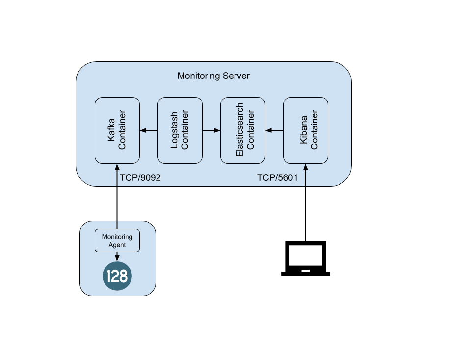

# 128T Monitoring Server #

This repository contains files and instructions that can be used to setup a basic monitoring dashboard for a 128T deployment.  The dashboard is built on top of Elastic Stack and is fed by data from the 128T Monitoring Agent.

## Topology ##



The above drawing illustrates the architecture of the Monitoring Server.  In this architecture, we will leverage Telegraf's kafka output to have the 128T Monitoring Agent send data to a kafka broker as a producer.  Logstash will connect to the Kafka broker as a consumer in order to pull data from the telegraf topic, perform some pre-processing of the data, and output the data into an Elasticsearch index.  Kibana will then be used to produce visualizations of the data in Elasticsearch.

Both Kafka and Elastic Stack are highly scalable solutions.  However, details on how to scale these products is beyond the scope of this documentation.  In this guide, we will provide instructions to setup a simple, simplex deployment for rapidly exploring the 128T Monitoring Data.  Additional information for scaling of Kafka or Elastic Stack for large deployments should be found in the respective solutions' documentation.

## Monitoring Server Setup ##

These instructions are based on a host system installed from a CentOS 1804 image.  Other Linux OS variants should be usable provided the setup instructions are modified appropriately.

Any software or external firewalls should be configured to allow the following traffic in to the Linux host:
* TCP/9092 for Kafka
* TCP/5601 for Kibana
* TCP/22 for SSH

The following sections should be run as root

### Install docker and docker compose ###
We will use docker to rapidly deploy the setup.  Please use the following commands to install docker:
```
yum-config-manager \
    --add-repo \
    https://download.docker.com/linux/centos/docker-ce.repo

yum install docker-ce docker-ce-cli containerd.io
```

Once docker is installed, start and enable the docker service:
```
systemctl start docker
systemctl enable docker
```

Install docker-compose to be able to build the monitoring server from the provided docker-compose.yml file:
```
curl -L "https://github.com/docker/compose/releases/download/1.25.5/docker-compose-$(uname -s)-$(uname -m)" -o /usr/local/bin/docker-compose
chmod +x /usr/local/bin/docker-compose
```

### Setup the environment file for the Kafka container ###
Kafka must be informed of the address the producers will use to connect.  Please create a file called `kafka.env` in the root directory of the repo.  Its contents should resemple:
```
ADVERTISED_HOST=X.X.X.X
```
Where `X.X.X.X` is the address that the producers will use to connect to the kafka broker.  If this host sits behind an elastic IP or other NAT, be sure to use the external NAT address and not the host's local IP address.  Most scenarios aside from this should use the host's local IP address.

### Bring up the monitoring server ###
Use docker-compose to build the monitoring server by running the following command:
```
docker-compose up -d
```

### Configure Monitoring Agent Output ###
This section contains a snippet of the monitoring agent configuration.  For full details on the monitoring agent configuration, please visit the [128T Documentation Site](https://docs.128technology.com/docs/plugin_monitoring_agent/).  

Any 128T Monitoring Agent that connects to this monitoring server will need a configuration file for the kafka output.  Please put the following contents in `/var/lib/128t-monitoring/outputs/kafka.conf` on these system:
```
[[outputs.kafka]]
  ## URLs of kafka brokers
  brokers = ["X.X.X.X:9092"]
  ## Kafka topic for producer messages
  topic = "telegraf"
  max_retry = 3
  data_format = "json"
```
Where `X.X.X.X` is the address of the Kafka broker as configured in the ADVERTISED_HOST environment variable above.  This output should then be referenced in the `/etc/128t-monitoring/config.yaml` file.  A sample of this file is shown below (please change as appropriate for the metrics you wish to use):
```
enabled: true
tags:
- key: router
  value: ${ROUTER}
- key: node
  value: ${NODE}
sample-interval: 15
push-interval: 180
inputs:
- name: t128_events
- name: t128_metrics
- name: t128_top_analytics
- name: t128_device_state
- name: t128_peer_path
outputs:
- name: kafka
```
This monitoring server setup will understand data from the following inputs: t128_events, t128_top_analytics, t128_device_state, t128_peer_path, t128_lte_metric, and t128_metrics.  The dashboards expect only the default metric set for the t128_metrics.  To update the monitoring agent configuration for these changes and start/restart the services, run the following command:
```
monitoring-agent-cli configure
```

### Import Provided Dashboards ###
In a web browser, navigate to the monitoring server on port 5601.  Click on the gear icon in the menu in the left pane to Management settings.  Under the Kibana section of the menu, click the link for Saved Objects.  Click on the Import link in the upper right.  Navigate to the location of the 128t-monitoring-dashboards.ndjson file provided with this repo and click the Import button.  You should receive a message that the import was successful.  Click Done.

Often after importing the saved objects, Kibana does not immediately operate as expected when navigating through the menu.  It is suggested after import to close your browser tab and open a new session to Kibana.
